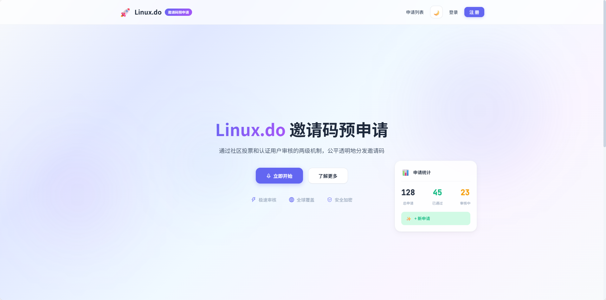
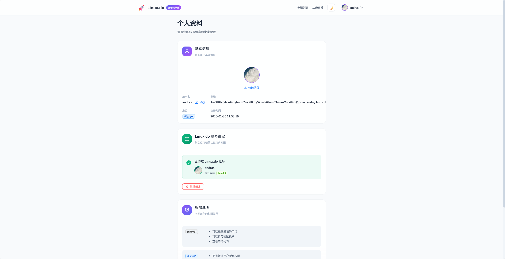
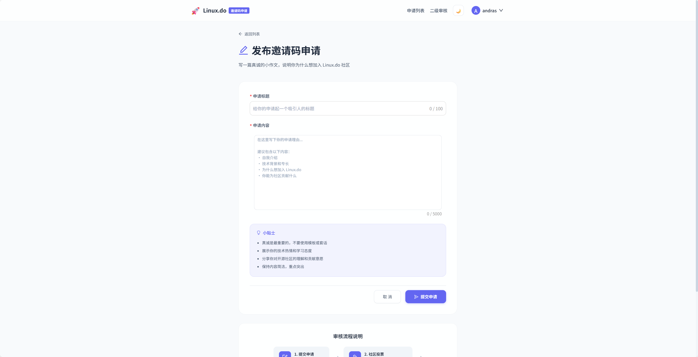
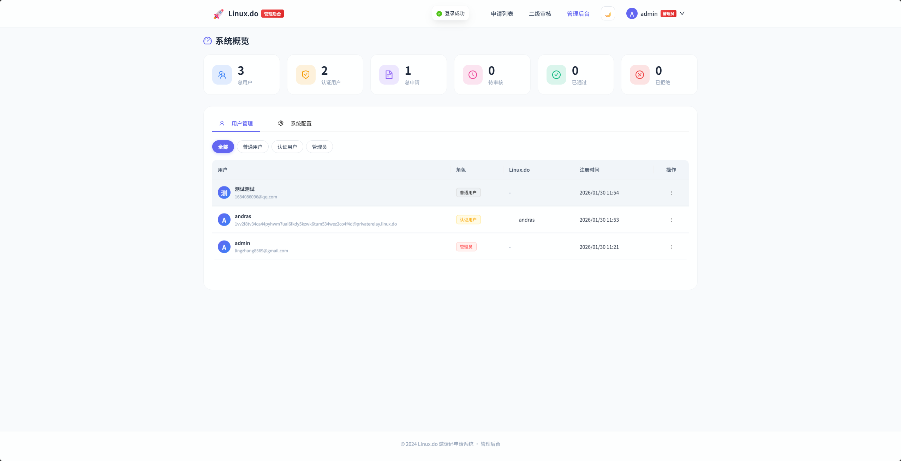
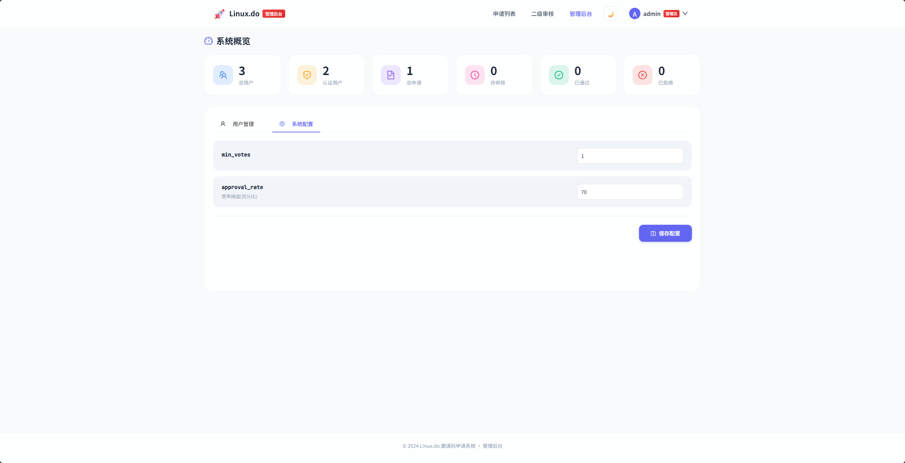

# Linux.do 邀请码预申请系统

一个公平透明的邀请码分发平台，通过社区投票和认证用户审核的两级机制来分发邀请码。

## ✨ 功能特性

- 🔐 **用户系统** - 支持邮箱注册登录，以及 Linux.do OAuth 快捷登录
- 📝 **申请发布** - 用户撰写小作文说明申请理由
- 👍 **社区投票** - 所有注册用户参与投票，共同决定申请是否通过初审
- ✅ **二级审核** - 通过初审的申请由 Linux.do 认证用户进行最终审核
- 📧 **邮件通知** - 审核通过后自动发送邀请码到申请者邮箱
- 🌓 **深色模式** - 支持亮色/暗色主题切换
- 📱 **响应式设计** - 完美适配桌面端和移动端

## 📸 界面预览

### 首页

*邀请码预申请系统首页，展示系统介绍和申请统计*

### 登录页面

*支持邮箱密码登录和 Linux.do OAuth 登录*

### 社区投票区

*查看所有申请，按状态筛选，参与社区投票*

### 二级审核

*认证用户审核通过社区投票的申请，可选择同意、跳过或拒绝*

### 个人资料

*管理账号信息，绑定 Linux.do 账号获取认证用户权限*

### 发布申请

*撰写申请小作文，说明为什么想加入 Linux.do 社区*

### 管理后台 - 用户管理

*管理员可查看和管理所有用户，修改用户角色*

### 管理后台 - 系统配置

*配置系统参数，如最小投票数和赞成率阈值*

## 🛠️ 技术栈

**前端**
- Vue 3 + TypeScript
- Vite
- Ant Design Vue
- Pinia 状态管理
- Vue Router

**后端**
- Go + Gin
- GORM + SQLite
- JWT 认证

## 📦 快速开始

### 环境要求

- Go 1.21+
- Node.js 18+
- pnpm / npm

### 1. 克隆项目

```bash
git clone https://github.com/your-username/linuxdo-review.git
cd linuxdo-review
```

### 2. 配置文件

复制配置文件模板并修改：

```bash
cp config.yaml.example config.yaml
```

编辑 `config.yaml` 配置以下内容：

```yaml
# 服务器配置
server:
  port: 8080
  mode: debug  # debug, release, test
  frontend_url: ""  # 前端地址，生产环境建议配置

# JWT配置
jwt:
  secret: your-jwt-secret-key  # 请修改为随机字符串
  expire_hours: 72

# 审核配置
review:
  min_votes: 10        # 进入二级审核的最小票数
  approval_rate: 70    # 赞成率阈值(百分比)

# SMTP邮件配置
smtp:
  host: smtp.example.com
  port: 587
  user: "your-email@example.com"
  password: "your-smtp-password"
  from: "your-email@example.com"

# Linux.do OAuth配置
oauth:
  linuxdo:
    client_id: "your-client-id"
    client_secret: "your-client-secret"
    redirect_uri: http://localhost:8080/api/auth/oauth/linuxdo/callback
```

### 3. 启动后端

```bash
cd backend
go mod tidy
go run main.go
```

后端默认运行在 `http://localhost:8080`

### 4. 启动前端

```bash
cd frontend
npm install
npm run dev
```

前端默认运行在 `http://localhost:5173`

## 📖 申请流程

```
┌─────────────┐    ┌─────────────┐    ┌─────────────┐    ┌─────────────┐
│  提交申请   │ -> │  社区投票   │ -> │  认证审核   │ -> │ 获取邀请码  │
│  撰写小作文 │    │ 获得足够赞  │    │ 认证用户审  │    │ 邮件接收码  │
└─────────────┘    └─────────────┘    └─────────────┘    └─────────────┘
```

1. **提交申请** - 用户撰写小作文说明申请理由
2. **社区投票** - 需要获得足够赞成票（默认10票以上，70%赞成率）
3. **认证审核** - 进入审核队列，由 Linux.do 认证用户审核
4. **获取邀请码** - 审核通过后，邀请码通过邮件发送

## 🔑 用户角色

| 角色 | 权限 |
|------|------|
| 普通用户 | 发布申请、查看列表、参与投票 |
| 认证用户 | 以上权限 + 二级审核权限 |
| 管理员 | 以上权限 + 后台管理 |

## 🔗 Linux.do OAuth 配置

1. 前往 [Linux.do](https://linux.do) 注册开发者应用
2. 获取 `client_id` 和 `client_secret`
3. 设置回调地址为 `http://your-domain/api/auth/oauth/linuxdo/callback`
4. 将配置填入 `config.yaml`

## 📁 项目结构

```
linuxdo-review/
├── backend/                 # 后端代码
│   ├── config/             # 配置加载
│   ├── database/           # 数据库初始化
│   ├── dto/                # 数据传输对象
│   ├── handler/            # HTTP处理器
│   ├── middleware/         # 中间件
│   ├── models/             # 数据模型
│   ├── pkg/                # 工具包
│   ├── repository/         # 数据访问层
│   ├── router/             # 路由配置
│   ├── service/            # 业务逻辑层
│   └── main.go
├── frontend/               # 前端代码
│   ├── src/
│   │   ├── api/           # API 请求
│   │   ├── router/        # 路由配置
│   │   ├── stores/        # Pinia 状态管理
│   │   ├── styles/        # 全局样式
│   │   ├── types/         # TypeScript 类型
│   │   └── views/         # 页面组件
│   └── ...
├── config.yaml             # 配置文件
└── README.md
```

## 🚀 部署

### Docker Compose 部署（推荐）

1. 确保已配置 `config.yaml`

2. 使用 Docker Compose 启动：

```bash
# 构建并启动
docker-compose up -d

# 查看日志
docker-compose logs -f

# 停止服务
docker-compose down
```

### Docker 手动部署

```bash
# 构建镜像
docker build -t linuxdo-review .

# 运行容器
docker run -d \
  --name linuxdo-review \
  -p 8080:8080 \
  -v $(pwd)/config.yaml:/app/config.yaml:ro \
  -v $(pwd)/data:/app/data \
  --restart unless-stopped \
  linuxdo-review
```

### 手动部署

1. 构建前端

```bash
cd frontend
npm install
npm run build
```

2. 构建后端

```bash
cd backend
go build -o linuxdo-review main.go
```

3. 复制静态文件

```bash
mkdir -p static
cp -r ../frontend/dist/* static/
```

4. 运行

```bash
# 确保 config.yaml 在当前目录
./linuxdo-review
```

服务启动后访问 `http://localhost:8080`

## 📄 License

[MIT License](LICENSE)

## 🤝 贡献

欢迎提交 Issue 和 Pull Request！
